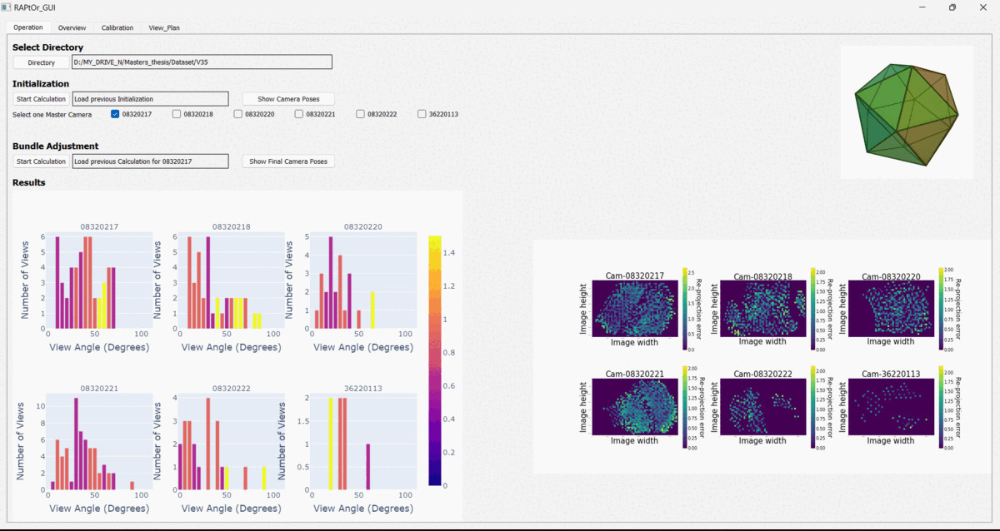
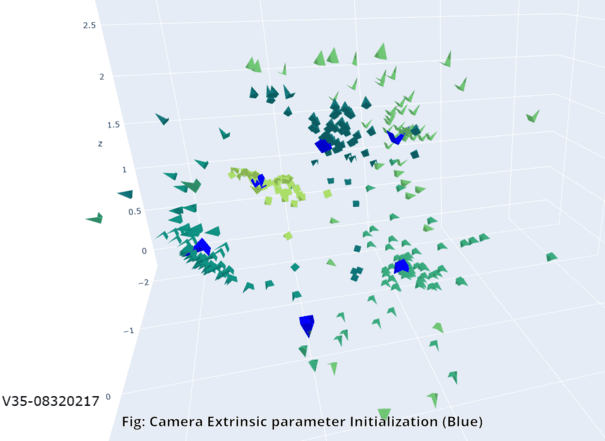
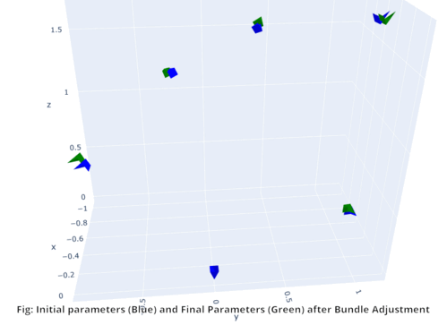

# Automated_Camera_Calibration
This GUI automates the whole calibration process also shows results of the calibration. One can also investigate the dataset quality using this.
The whole process of operating this is explained here.

  
  
  
 

