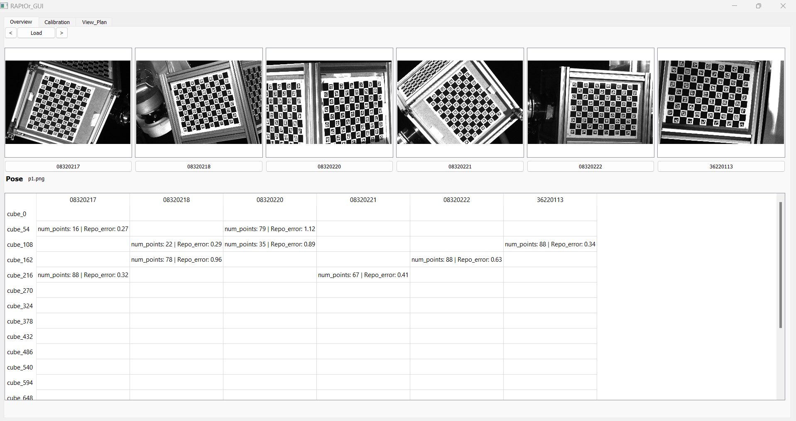
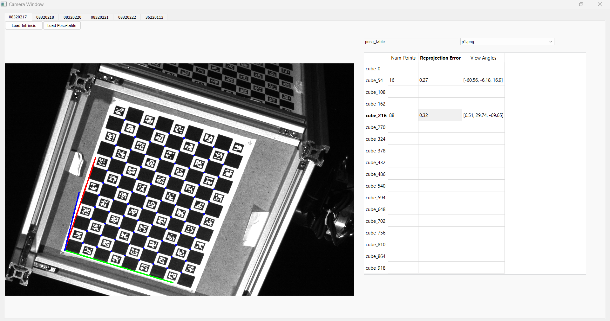
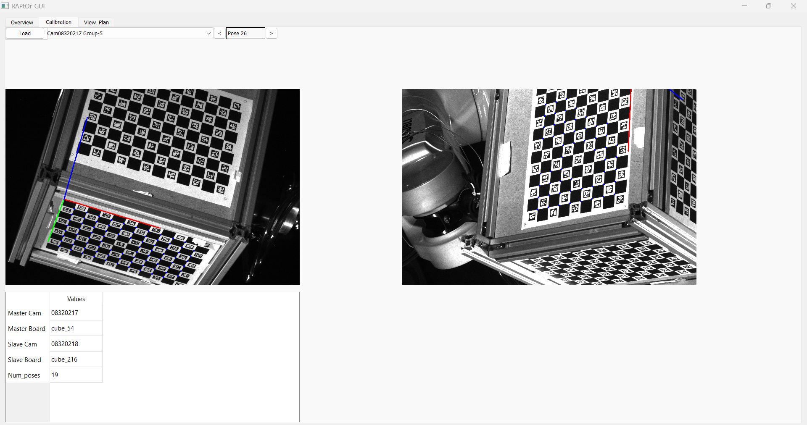

# Automated_Camera_Calibration
This GUI automates the whole calibration process also shows results of the calibration. One can also investigate the dataset quality using this.
 
# Usage
## Operation Tab

  
  
  
 

 
## Overview Tab

  
 

 
## Camera Window

  
 

 
## Calibration Tab

  
 

